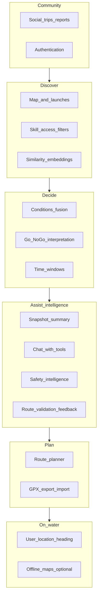

# EddyScout — product roadmap

High-level feature map for a PNW-focused kayak companion: **decision-first**, **local nuance**, **conditions fusion**, **honest safety framing**, and **Flutter + Mapbox** on the client. This document is a living plan; tick or adjust as you ship.

> **Platform work:** **wave 3 is done** — Bucket B screen migration complete (#35, #36, app-shell closeout). Start **Phase C** slices below. New product UI belongs in `packages/features/*/presentation/`, not `apps/eddyscout/lib/screens/`.
>
> **Last updated:** 2026-06-06

## Vision

EddyScout helps paddlers **discover where to go**, **understand river and weather context in one place**, and **decide if today makes sense** for their skill level—starting in the Portland / greater PNW area. It is not a replacement for judgment, training, or on-scout assessment.

## Product pillars

| Pillar | Intent |
|--------|--------|
| **Discover** | Map, launches, filters (skill, access, hazards); optional **semantic “similar to”** via embeddings. |
| **Decide** | Fuse weather, wind, flow, tides where relevant; output Go / marginal / no-go + reasons. |
| **Assist (LLM)** | Summaries, Q&A, and coaching **grounded in fetched data + curated metadata**—not a replacement for judgment. |
| **Plan** | Routes, put-in / take-out, GPX. |
| **On-water** | Location, bearing, later drift-aware hints; optional offline. |
| **Community** | Trips, condition reports, finding paddlers—without unsafe defaults on live tracking. |

---

## Feature list (your themes + gaps)

| # | Feature | In-product meaning | Notes |
|---|---------|-------------------|--------|
| 1 | **Weather** | Temp, precip, clouds; NOAA or a focused weather API | Wind is a separate axis for paddlers; hyperlocal matters (Columbia, gorge). |
| 2 | **River conditions** | Wood, dam releases, “sketchy at this flow,” closures | Largely **not** in public APIs → crowdsourced + curated **local intelligence**. |
| 3 | **Wind** | Speed + **gusts**, direction; marine zones where relevant | Open water and fetch; tie to **segment exposure** over time. |
| 4 | **River flow / speed** | USGS cfs / gauge height; **gauge → launch or segment**, not one number per whole river | **Per-stretch** flow bands (min / optimal / max). |
| 5 | **Go / no-go** | Clear call + reasons + **marginal**; legal/UX **disclaimer** | Include cold water and skill; avoid false confidence. |
| 6 | **Route planner** | Put-in / take-out, snap or align to water; later drift vs wind | Needs **river geometry** or curated segments. |
| 7 | **Social** | Trip intent, post-trip reports (conditions, wildlife), find paddlers | Start with **planned trips + TTL**; moderation + privacy before heavy live location. |
| 8 | **Authentication** | Accounts, saved content, posts | Defer until social or saved routes need identity. |
| — | **Tides / currents** | Estuary, coastal, Sauvie-adjacent | NOAA tides/currents APIs. |
| — | **Cold water / safety UX** | Hypothermia / cold-shock awareness; education links | Persistent PNW-relevant messaging. |
| — | **User location + “which way”** | GPS, bearing to waypoint; later smarter drift hints | Core **on-water** value from early product discussions. |
| — | **Offline** | Cached tiles; optional last-known conditions | Mapbox offline + scoped geography. |
| — | **Alerts** | Flow or wind thresholds | Often pairs with subscriptions later. |
| — | **Trip log / GPX** | History, export, share | Complements routes and social. |
| — | **Access / permits / tribal** | Legality, seasonality, respect for restrictions | Static metadata + clear UI tags. |
| — | **Legal / attribution** | Mapbox, USGS, NOAA; liability copy | Ship early. |
| — | **Condition snapshot summary (LLM)** | Short narrative digest of the current **ConditionsSnapshot** + launch tags (exposure, tide relevance, river system) | **Grounded:** model input is structured JSON + timestamps; output is “planning copy,” not a safety guarantee. |
| — | **Conditions chat (LLM + tools)** | User asks questions; model calls **tools** to refresh or re-fetch NWS / USGS / tides / marine as needed | Tools = same provider layer as today (`ConditionsService` or successors); no browsing arbitrary web unless explicitly added later. |
| — | **Route validation / feedback (LLM)** | User describes or selects put-in / take-out (or future drawn route); model **comments on plausibility** vs curated segments, distance class, exposure—**not** turn-by-turn navigation | Start as “validation / sanity check” before full geometry-backed planner. |
| — | **Safety intelligence layer (LLM + rules)** | Cold water, skill fit, PFD/whistle/permits, when to bail—**templated canonical facts** + optional LLM phrasing; reinforce disclaimers | Must not contradict static safety copy; optional RAG over **your** editorial docs later—not open-ended medical advice. |
| — | **Embeddings & similarity search** | **“Similar launches”** / **similar routes** / similar trip reports by embedding a short **canonical text profile** per entity (name, river, exposure, notes, skill tags, distance class) | Feasible and common pattern: **vector DB** (e.g. pgvector, hosted vector index) or on-device for small corpora; combine with **filters** (distance, river system, skill) so results stay sensible. Rebuild or upsert vectors when curated data changes. |

**Hidden but critical:** **gauge–segment–launch data model** (which USGS site applies to which stretch)—this is foundational for items 4 and 5. **Embedding corpus** (what text you embed + version) is similarly foundational for trustworthy similarity.

---

## Execution order

Product phases (A–F below) assume **wave 3** in `docs/ARCHITECTURE_BACKLOG.md` is complete. New UI belongs in feature `presentation/` packages.

| Step | Work | Doc | Status |
|------|------|-----|--------|
| 1 | **Wave 2** — Bucket A (`@riverpod` router, Result boundaries, doc sweep) | `ARCHITECTURE_BACKLOG.md` § Bucket A | **Done** (#28–#33, #31) |
| 2 | **Wave 3** — Bucket B screen migration to feature `presentation/` | `ARCHITECTURE_BACKLOG.md` § Bucket B | **Done** (#35, #36, closeout) |
| 3 | **Phase C+** — product slices in this file (GPX, saved routes, moderation, …) | This file § Master checklist | **Now** |

**Infra deferrals** (`flutter_secure_storage`, tab shell, `CachedNetworkImage`, session auth guards) ship **with** the product feature that needs them — not as wave 2/3 blockers.

---

## Phasing

### Recommended next implementation

**Now (product — Phase C):** Prioritize **GPX export / trip log**, **saved routes (v1)**, and **route planner follow-ups** (more rivers, segment snap). **Moderation** for condition reports is an alternative early Phase C slice if community trust is the bottleneck.

**Done (platform):** Wave 3 — feature presentation migration + app-shell closeout (#35, #36). Wave 2 — `@riverpod` routing (#30), Result boundaries (#28, #32, #33), doc closeout (#31).

**Already shipped (context):** Route preview (v1) — planning mode on the map, put-in / take-out from launches, polyline along bundled hydro GeoJSON (`assets/hydro/`; Willamette Portland reach first).

---

## Master implementation checklist (living)

Single list of **everything** tracked for build progress. Tags show the original phase/pillar. Update `- [ ]` → `- [x]` here only (no duplicate subsection checklists).

### Shipped

- [x] **(Phase A)** Map + Mapbox + expanded regional launch pins
- [x] **(Phase A)** Tap launch → detail with **NWS** weather (Open-Meteo fallback), **USGS** flow where linked, **NOAA** tides, exposure/tide tags
- [x] **(Phase A)** **NWS marine** on launch detail (Coastal Waters Forecast / zone extract; not `/zones/marine/{id}/forecast`)
- [x] **(Phase A)** Local Mapbox token via `.local.env` + script
- [x] **(Phase A)** In-app **safety / disclaimer** on launch detail (extend globally as needed)
- [x] **(Phase A)** **Stub Go/No-Go** rules engine (wind, marine keywords, coarse cfs by river class; marginal / no-go / insufficient data)
- [x] **(Phase B)** Per-launch **cfs bands** (`LaunchFlowBands`; evaluator prefers bands, else river-class fallback)
- [x] **(Phase B)** **Skill profile** (beginner / intermediate / advanced) → wind thresholds + `SharedPreferences` + UI on launch detail
- [x] **(Phase B)** **Forecast time hint** (`periodStart` low-light hours → info only)
- [x] **(Phase B)** Gust-aware wind + marine text + flow rules in evaluator
- [x] **(Firebase)** Repo `firebase/` Functions (`us-west2`): `submitConditionReport`, `listConditionReports`, `summarizeLaunchReports`, `summarizeConditions` (Anthropic; deploy + secrets)
- [x] **(Firebase)** Firestore `conditionReports` writes **only** from Admin SDK; Callables from client; rules deny broad client access
- [x] **(Firebase)** Flutter: `firebase_core`, `cloud_functions`, `firebase_auth` (anonymous), `USE_FIREBASE`, JSON payload for summaries
- [x] **(Firebase)** **Report conditions** sheet + **AI summary** card when Firebase init succeeds
- [x] **(Firebase)** Cloud Run **invoker** + Android callable auth path (see `firebase/DEPLOY.md`)
- [x] **(Reports)** List recent reports per launch — `listConditionReports`; time-ordered list; light attribution
- [x] **(Reports)** AI digest of recent reports — `summarizeLaunchReports`; cache (`launchReportDigests`) + rate limits (`reportDigestRate`)
- [x] **(Reports)** Trust copy on digest; raw report list below digest on launch detail
- [x] **(Phase D)** In-app condition reports **reader + digest** (same as **Reports** rows above)
- [x] **(Phase E)** **Default model** path — Haiku via Cloud Function for summaries
- [x] **(Phase E)** **Snapshot summary (v1)** — `summarizeConditions` + “Summarize with AI” on launch detail
- [x] **(Phase E)** **Reports digest** (community notes paraphrase; see **Reports** rows above)
- [x] **(Infra)** Result-based providers + cancellation (CancelToken / callable cancel guards) for conditions, reports, and AI summary

### Not yet

> **Gate:** Phase C items below are **ready to implement** now that wave 3 in `docs/ARCHITECTURE_BACKLOG.md` is complete.

- [ ] **(Reports / mod)** Moderation — admin queue, TTL, keyword hold (optional report-abuse UX)
- [x] **(Phase C)** Route preview on map — planning mode, put-in / take-out from existing launches, path along bundled open hydro LineStrings (`assets/hydro/`; Willamette Portland reach first); not navigation-grade
- [ ] **(Phase C)** Route planner follow-ups — more rivers / NHD-quality lines, GPX, saved trips
- [ ] **(Phase C)** GPX export / import
- [ ] **(Phase C)** Trip log
- [ ] **(Phase C)** Saved routes (v1) — name/description, categories, favorites, notes, private by default
- [ ] **(Phase C)** Saved routes metadata (v1) — difficulty, distance, time estimate, exposure, tide dependency, skill level
- [ ] **(Phase C)** Route editing (v1) — add waypoint(s), drag points, multi-stop, loop routes
- [ ] **(Phase C)** **Auth** when identity is required for saves
- [ ] **(Phase D)** Planned trips / trip intent
- [ ] **(Phase D)** Moderation posture (policy + product, beyond technical queue above)
- [ ] **(Phase D)** **Live pins** only with explicit privacy/product decision
- [ ] **(Phase D)** User profile (v1) — basic stats, achievements placeholder, activity history
- [ ] **(Phase D)** Social feed (v1) — follow, likes/comments, basic posting
- [ ] **(Phase D)** Trip sharing (v1) — share cards + route screenshots + privacy controls
- [ ] **(Phase D)** Privacy controls (v1) — public/private trips, blur start/end, hide home launch
- [ ] **(Phase D)** Community reports expansion — hazards, debris, closures, boat traffic, algae blooms, wildlife
- [ ] **(Phase D)** Launch contributions (v1) — add/edit launches, photos, description edits, report inaccuracies
- [ ] **(Phase D)** Reputation / trust (v1) — badges, verified reports, moderation hooks
- [ ] **(Phase E)** **Model-agnostic client** (`LlmClient`-style abstraction)
- [ ] **(Phase E)** **Chat + tools** (refresh conditions, list launches, etc.)
- [ ] **(Phase E)** **Route validation** (LLM + structured gaps, no invented hazards)
- [ ] **(Phase E)** **Safety intelligence** (canonical facts + optional LLM phrasing)
- [ ] **(Phase E)** **Ops** — quotas, logging, cost dashboards
- [ ] **(Phase E)** Go / No-go typed reasons → localized labels (enum/codes + ARB; no raw reason strings in UI)
- [ ] **(Phase E)** Conditions intelligence (v2) — user thresholds (wind/current/temp), alerts, time windows
- [ ] **(Phase E)** Dynamic risk scoring (v1) — beginner safe / caution / expert only (wind/gust/current/tide/darkness/temp/exposure)
- [ ] **(Phase E)** Float plans (v1) — route + emergency contacts + return time + overdue reminder flow
- [ ] **(Phase E)** Safety alerts (v1) — “storm approaching”, “exceeds your threshold”, “current increasing”
- [ ] **(Phase F)** **Embedding model** (pluggable API / local)
- [ ] **(Phase F)** **Launch similarity (v1)** — profiles + nearest neighbors (“Similar ramps”)
- [ ] **(Phase F)** **Query paths** — from launch + optional NL
- [ ] **(Phase F)** **Route similarity** (after routes exist)
- [ ] **(Phase F)** **Hybrid search** (geo / river / skill filters)
- [ ] **(Phase F)** **Ops** — index versioning, backfill, no live cfs in embeddings
- [ ] **(Phase F)** AI route recommendations (v1) — “protected for wind”, “good on outgoing tide”, “beginner-friendly nearby”
- [ ] **(Phase F)** Route discovery surfaces (v1) — nearby, trending, beginner, scenic, weather-appropriate

### Remaining major features (from the feature table, not all on the build checklist)

These themes in **Feature list (your themes + gaps)** are still largely **future** relative to what the checklist tracks explicitly:

- **Map / discover:** skill & access **filters** on the map; **alerts** (flow/wind thresholds)
- **Decide:** richer **time windows**; **cold water / safety UX** beyond the launch disclaimer
- **On-water:** **User location + bearing** to waypoint; **offline** maps / cached conditions
- **Data / trust:** **Access / permits / tribal** metadata + UI tags
- **Social (beyond reports):** **Trip log** as history; fuller **social** (find paddlers, etc.) with the MVP non-goals still in mind

Additional feature themes explicitly on the product roadmap but not fully itemized above yet:

- **Trip recording (GPS)** — record/pause/resume/background + distance/duration/speed; later wind/current/tide-adjusted metrics
- **Live navigation** — on-route guidance, off-route detection, audible/vibration alerts, offline nav
- **Offline support** — offline maps, offline routes, offline navigation, offline recording, background sync on reconnect
- **Media** — photos/videos, trip cards, auto-generated summaries
- **Search & filtering** — route + launch search with facets (distance/difficulty/water type/wind protection/tide suitability/scenic)
- **Gamification** — achievements, challenges, streaks

---

## LLM / API strategy

- **Provider-agnostic:** One interface (e.g. `LlmClient`) with per-provider adapters (Anthropic, OpenAI, others). Model id + max tokens + tool schema passed per call.
- **Cost:** Prefer **Haiku-class** models for v1 chat and summaries; reserve larger models for optional “deep dive” if product demands it.
- **Grounding:** System prompts require the model to **only** cite numbers that appear in tool results or provided JSON; if unknown, say so.
- **Non-goal:** The LLM is not the legal “decision”—copy stays informational; Go/No-Go remains rules + human judgment.

---

## Embeddings / vector search (summary)

- **Possible:** Yes. Similarity search is **standard**: embed fixed text profiles for launches (and later routes), store vectors, retrieve **k nearest neighbors**; optionally merge scores with metadata filters.
- **Not magic:** Quality depends on **what you embed** (rich, consistent descriptions + tags) and **hybrid filters** (region, river, skill). Otherwise “similar” can mean linguistically close but geographically silly.
- **Conditions:** Do **not** rely on embeddings for “similar **current** weather”—that’s real-time data. Use embeddings for **place and route character**; keep conditions as separate queries.

---

## Data sources (target)

| Source | Use |
|--------|-----|
| **Mapbox** | Basemap, style, later offline |
| **USGS** | River discharge / gauge height |
| **NOAA** | Weather, marine text; tides/currents where applicable |
| **Crowd / editorial** | Hazards, wood, subjective stretch quality |
| **LLM provider (optional)** | e.g. Anthropic / OpenAI for summaries & chat—**keys** via env / backend; not required for core map + conditions |
| **Embedding provider (optional)** | API or local model for **launch/route vectors**; often separate from chat LLM; **model-agnostic** storage (dimension + provider id per index) |

Attribute and comply with each provider’s terms in the app.

---

## MVP non-goals (until explicitly pulled in)

- Full social graph, DMs, or always-on live location
- National coverage before PNW is strong
- Scuba / dive-specific flows (unless scope is intentionally split)
- Guaranteed “safe” verdicts (copy must stay informational)
- LLM **inventing** hazards, closures, or flows not present in tool/API output
- LLM-only **Go/No-Go** without explicit rules + disclaimers

---

## Risks

| Risk | Mitigation |
|------|------------|
| **Liability** from automated Go/No-Go | Disclaimers; prefer “marginal”; no medical or rescue guarantees |
| **Wrong gauge for stretch** | Model gauge–segment links; show data source + timestamp |
| **Social abuse / harassment** | Reports, blocks, minimal PII; TTL on location-ish posts |
| **Token / API costs** | Cache conditions; rate-limit; restrict geography early |
| **LLM hallucination next to safety** | Tool-grounding, strict system prompts, show sources; safety facts from canonical copy |
| **LLM spend / abuse** | Per-user or per-device quotas; Haiku by default; short context windows |
| **Bad similarity results** | Hybrid geo/skill filters; human-readable “why similar”; refresh embeddings when copy changes |

---

## How to use this file

- **Platform vs product:** architecture waves and merge order live in `docs/ARCHITECTURE_BACKLOG.md`; product phases and feature checklist live here.
- Update the **Master implementation checklist** (`- [ ]` → `- [x]`) when you ship; keep **Recommended next implementation** and **Execution order** in sync when priorities change.
- Before opening a Phase C PR, confirm wave 3 is done (or the slice is explicitly exempt — e.g. backend-only Firebase work).
- Add **dates** or **PR links** inline next to items when helpful.
- Trim the feature table above if you descope; keep **pillars** stable for narrative.
