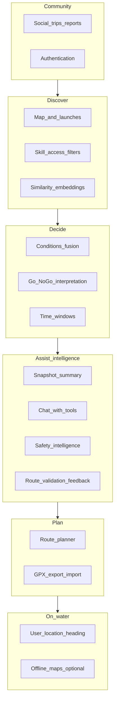

# EddyScout — product roadmap

High-level feature map for a PNW-focused kayak companion: **decision-first**, **local nuance**, **conditions fusion**, **honest safety framing**, and **Flutter + Mapbox** on the client. This document is a living plan; tick or adjust as you ship.

## Vision

EddyScout helps paddlers **discover where to go**, **understand river and weather context in one place**, and **decide if today makes sense** for their skill level—starting in the Portland / greater PNW area. It is not a replacement for judgment, training, or on-scout assessment.

## Product pillars

| Pillar | Intent |
|--------|--------|
| **Discover** | Map, launches, filters (skill, access, hazards); optional **semantic “similar to”** via embeddings. |
| **Decide** | Fuse weather, wind, flow, tides where relevant; output Go / marginal / no-go + reasons. |
| **Assist (LLM)** | Summaries, Q&A, and coaching **grounded in fetched data + curated metadata**—not a replacement for judgment. |
| **Plan** | Routes, put-in / take-out, GPX. |
| **On-water** | Location, bearing, later drift-aware hints; optional offline. |
| **Community** | Trips, condition reports, finding paddlers—without unsafe defaults on live tracking. |

---

## Feature list (your themes + gaps)

| # | Feature | In-product meaning | Notes |
|---|---------|-------------------|--------|
| 1 | **Weather** | Temp, precip, clouds; NOAA or a focused weather API | Wind is a separate axis for paddlers; hyperlocal matters (Columbia, gorge). |
| 2 | **River conditions** | Wood, dam releases, “sketchy at this flow,” closures | Largely **not** in public APIs → crowdsourced + curated **local intelligence**. |
| 3 | **Wind** | Speed + **gusts**, direction; marine zones where relevant | Open water and fetch; tie to **segment exposure** over time. |
| 4 | **River flow / speed** | USGS cfs / gauge height; **gauge → launch or segment**, not one number per whole river | **Per-stretch** flow bands (min / optimal / max). |
| 5 | **Go / no-go** | Clear call + reasons + **marginal**; legal/UX **disclaimer** | Include cold water and skill; avoid false confidence. |
| 6 | **Route planner** | Put-in / take-out, snap or align to water; later drift vs wind | Needs **river geometry** or curated segments. |
| 7 | **Social** | Trip intent, post-trip reports (conditions, wildlife), find paddlers | Start with **planned trips + TTL**; moderation + privacy before heavy live location. |
| 8 | **Authentication** | Accounts, saved content, posts | Defer until social or saved routes need identity. |
| — | **Tides / currents** | Estuary, coastal, Sauvie-adjacent | NOAA tides/currents APIs. |
| — | **Cold water / safety UX** | Hypothermia / cold-shock awareness; education links | Persistent PNW-relevant messaging. |
| — | **User location + “which way”** | GPS, bearing to waypoint; later smarter drift hints | Core **on-water** value from early product discussions. |
| — | **Offline** | Cached tiles; optional last-known conditions | Mapbox offline + scoped geography. |
| — | **Alerts** | Flow or wind thresholds | Often pairs with subscriptions later. |
| — | **Trip log / GPX** | History, export, share | Complements routes and social. |
| — | **Access / permits / tribal** | Legality, seasonality, respect for restrictions | Static metadata + clear UI tags. |
| — | **Legal / attribution** | Mapbox, USGS, NOAA; liability copy | Ship early. |
| — | **Condition snapshot summary (LLM)** | Short narrative digest of the current **ConditionsSnapshot** + launch tags (exposure, tide relevance, river system) | **Grounded:** model input is structured JSON + timestamps; output is “planning copy,” not a safety guarantee. |
| — | **Conditions chat (LLM + tools)** | User asks questions; model calls **tools** to refresh or re-fetch NWS / USGS / tides / marine as needed | Tools = same provider layer as today (`ConditionsService` or successors); no browsing arbitrary web unless explicitly added later. |
| — | **Route validation / feedback (LLM)** | User describes or selects put-in / take-out (or future drawn route); model **comments on plausibility** vs curated segments, distance class, exposure—**not** turn-by-turn navigation | Start as “validation / sanity check” before full geometry-backed planner. |
| — | **Safety intelligence layer (LLM + rules)** | Cold water, skill fit, PFD/whistle/permits, when to bail—**templated canonical facts** + optional LLM phrasing; reinforce disclaimers | Must not contradict static safety copy; optional RAG over **your** editorial docs later—not open-ended medical advice. |
| — | **Embeddings & similarity search** | **“Similar launches”** / **similar routes** / similar trip reports by embedding a short **canonical text profile** per entity (name, river, exposure, notes, skill tags, distance class) | Feasible and common pattern: **vector DB** (e.g. pgvector, hosted vector index) or on-device for small corpora; combine with **filters** (distance, river system, skill) so results stay sensible. Rebuild or upsert vectors when curated data changes. |

**Hidden but critical:** **gauge–segment–launch data model** (which USGS site applies to which stretch)—this is foundational for items 4 and 5. **Embedding corpus** (what text you embed + version) is similarly foundational for trustworthy similarity.

---

## Phasing

### Phase A — Solo paddler loop (no auth)

| Item | Status |
|------|--------|
| Map + Mapbox + expanded regional launch pins | **Shipped** |
| Tap launch → detail with **NWS** weather (Open-Meteo fallback), **USGS** flow where linked, **NOAA** tides, **NWS marine** zones, exposure/tide tags | **Shipped** |
| Local Mapbox token via `.local.env` + script | **Shipped** |
| In-app **safety / disclaimer** on launch detail | **Shipped** (extend globally as needed) |
| **Stub Go/No-Go** rules engine (marginal states, skill + cold water) | Not started |

### Phase B — Decision engine v1

Per-launch gauge linkage, flow bands, gust-aware wind, marginal states; optional lightweight “report” capture (store later).

### Phase C — Plan + log

Route planner MVP, GPX export, trip log; **auth** when identity is required.

### Phase D — Community

Planned trips, condition reports, moderation; **live pins** only if product + privacy posture is explicit.

### Phase E — Assistive intelligence (LLM) — plan only; ship incrementally

Not all items need to ship before the next; order is a suggested path.

| Item | Intent |
|------|--------|
| **Model-agnostic client** | One internal abstraction (e.g. “completion + optional tool calls”) with pluggable backends so swapping **Claude Haiku ↔ Sonnet ↔ GPT ↔ local** is configuration, not a rewrite. |
| **Default model** | Start with **Claude Haiku** for cost/latency on summaries and short chat turns; escalate tier later for heavier reasoning if needed. |
| **Snapshot summary** | Generate 2–4 sentences from `ConditionsSnapshot` + `LaunchPoint` metadata; show “last updated” and data sources used. |
| **Chat + tools** | Expose tools: `get_conditions(launchId \| lat/lon)`, optionally `list_launches_in_bbox`, later `get_usgs`, etc., implemented by calling existing Dart services server-side or on-device. |
| **Route validation** | Input: named launches or future segment IDs + user skill text; output: checklist-style feedback, gaps (“we don’t have wood data here”), no invented hazards. |
| **Safety intelligence** | Combine **fixed** PNW cold-water / permit bullets with LLM rephrasing; same disclaimer stack as the rest of the app. |
| **Ops** | Rate limits, logging, no PII in prompts by default, cost dashboards; optional small backend for API keys if not on-device. |

### Phase F — Semantic discovery (embeddings) — plan; pairs with curated data

| Item | Intent |
|------|--------|
| **Embedding model (agnostic)** | Same idea as LLM: pluggable **embedding API** (OpenAI, Voyage, Cohere, etc.) or **local** models later; normalize dimensions per backend. |
| **Launch similarity (v1)** | For each `LaunchPoint`, build a stable string (or JSON → string) from name, river system, exposure, tide relevance, `shortNote`, optional tags; **batch embed** on deploy or admin job; **nearest neighbors** for “Similar ramps.” |
| **Query paths** | From a **selected launch** (“more like this”) and/or **natural language** (“sheltered put-in on the Willamette near Portland”)—NL may still hit embeddings or route through LLM to structured filters + vector search. |
| **Route similarity (later)** | Once routes/segments exist as first-class objects, embed route summaries (put-in/take-out names, mileage, skill, typical flow band); “Similar trips” for planning. |
| **Hybrid search** | Always constrain by **bbox**, **river**, **skill**, or **distance** where possible so pure vector closeness does not suggest irrelevant geography. |
| **Ops** | Index versioning, backfill script, monitoring for drift when copy changes; **no** embedding of live conditions numbers (stale in minutes)—similarity is for **place/route character**, not today’s cfs. |

---

## LLM / API strategy

- **Provider-agnostic:** One interface (e.g. `LlmClient`) with per-provider adapters (Anthropic, OpenAI, others). Model id + max tokens + tool schema passed per call.
- **Cost:** Prefer **Haiku-class** models for v1 chat and summaries; reserve larger models for optional “deep dive” if product demands it.
- **Grounding:** System prompts require the model to **only** cite numbers that appear in tool results or provided JSON; if unknown, say so.
- **Non-goal:** The LLM is not the legal “decision”—copy stays informational; Go/No-Go remains rules + human judgment.

---

## Embeddings / vector search (summary)

- **Possible:** Yes. Similarity search is **standard**: embed fixed text profiles for launches (and later routes), store vectors, retrieve **k nearest neighbors**; optionally merge scores with metadata filters.
- **Not magic:** Quality depends on **what you embed** (rich, consistent descriptions + tags) and **hybrid filters** (region, river, skill). Otherwise “similar” can mean linguistically close but geographically silly.
- **Conditions:** Do **not** rely on embeddings for “similar **current** weather”—that’s real-time data. Use embeddings for **place and route character**; keep conditions as separate queries.

---

## Data sources (target)

| Source | Use |
|--------|-----|
| **Mapbox** | Basemap, style, later offline |
| **USGS** | River discharge / gauge height |
| **NOAA** | Weather, marine text; tides/currents where applicable |
| **Crowd / editorial** | Hazards, wood, subjective stretch quality |
| **LLM provider (optional)** | e.g. Anthropic / OpenAI for summaries & chat—**keys** via env / backend; not required for core map + conditions |
| **Embedding provider (optional)** | API or local model for **launch/route vectors**; often separate from chat LLM; **model-agnostic** storage (dimension + provider id per index) |

Attribute and comply with each provider’s terms in the app.

---

## MVP non-goals (until explicitly pulled in)

- Full social graph, DMs, or always-on live location
- National coverage before PNW is strong
- Scuba / dive-specific flows (unless scope is intentionally split)
- Guaranteed “safe” verdicts (copy must stay informational)
- LLM **inventing** hazards, closures, or flows not present in tool/API output
- LLM-only **Go/No-Go** without explicit rules + disclaimers

---

## Risks

| Risk | Mitigation |
|------|------------|
| **Liability** from automated Go/No-Go | Disclaimers; prefer “marginal”; no medical or rescue guarantees |
| **Wrong gauge for stretch** | Model gauge–segment links; show data source + timestamp |
| **Social abuse / harassment** | Reports, blocks, minimal PII; TTL on location-ish posts |
| **Token / API costs** | Cache conditions; rate-limit; restrict geography early |
| **LLM hallucination next to safety** | Tool-grounding, strict system prompts, show sources; safety facts from canonical copy |
| **LLM spend / abuse** | Per-user or per-device quotas; Haiku by default; short context windows |
| **Bad similarity results** | Hybrid geo/skill filters; human-readable “why similar”; refresh embeddings when copy changes |

---

## How to use this file

- Check off **Phase A** rows as you complete them.
- Add **dates** or **links to issues** in a column if you track work elsewhere.
- Trim the feature table if you descope; keep **pillars** stable for narrative.
