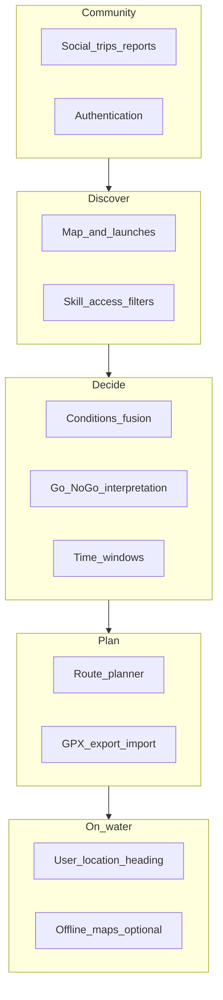

# EddyScout — product roadmap

High-level feature map for a PNW-focused kayak companion: **decision-first**, **local nuance**, **conditions fusion**, **honest safety framing**, and **Flutter + Mapbox** on the client. This document is a living plan; tick or adjust as you ship.

## Vision

EddyScout helps paddlers **discover where to go**, **understand river and weather context in one place**, and **decide if today makes sense** for their skill level—starting in the Portland / greater PNW area. It is not a replacement for judgment, training, or on-scout assessment.

## Product pillars

| Pillar | Intent |
|--------|--------|
| **Discover** | Map, launches, filters (skill, access, hazards). |
| **Decide** | Fuse weather, wind, flow, tides where relevant; output Go / marginal / no-go + reasons. |
| **Plan** | Routes, put-in / take-out, GPX. |
| **On-water** | Location, bearing, later drift-aware hints; optional offline. |
| **Community** | Trips, condition reports, finding paddlers—without unsafe defaults on live tracking. |

---

## Feature list (your themes + gaps)

| # | Feature | In-product meaning | Notes |
|---|---------|-------------------|--------|
| 1 | **Weather** | Temp, precip, clouds; NOAA or a focused weather API | Wind is a separate axis for paddlers; hyperlocal matters (Columbia, gorge). |
| 2 | **River conditions** | Wood, dam releases, “sketchy at this flow,” closures | Largely **not** in public APIs → crowdsourced + curated **local intelligence**. |
| 3 | **Wind** | Speed + **gusts**, direction; marine zones where relevant | Open water and fetch; tie to **segment exposure** over time. |
| 4 | **River flow / speed** | USGS cfs / gauge height; **gauge → launch or segment**, not one number per whole river | **Per-stretch** flow bands (min / optimal / max). |
| 5 | **Go / no-go** | Clear call + reasons + **marginal**; legal/UX **disclaimer** | Include cold water and skill; avoid false confidence. |
| 6 | **Route planner** | Put-in / take-out, snap or align to water; later drift vs wind | Needs **river geometry** or curated segments. |
| 7 | **Social** | Trip intent, post-trip reports (conditions, wildlife), find paddlers | Start with **planned trips + TTL**; moderation + privacy before heavy live location. |
| 8 | **Authentication** | Accounts, saved content, posts | Defer until social or saved routes need identity. |
| — | **Tides / currents** | Estuary, coastal, Sauvie-adjacent | NOAA tides/currents APIs. |
| — | **Cold water / safety UX** | Hypothermia / cold-shock awareness; education links | Persistent PNW-relevant messaging. |
| — | **User location + “which way”** | GPS, bearing to waypoint; later smarter drift hints | Core **on-water** value from early product discussions. |
| — | **Offline** | Cached tiles; optional last-known conditions | Mapbox offline + scoped geography. |
| — | **Alerts** | Flow or wind thresholds | Often pairs with subscriptions later. |
| — | **Trip log / GPX** | History, export, share | Complements routes and social. |
| — | **Access / permits / tribal** | Legality, seasonality, respect for restrictions | Static metadata + clear UI tags. |
| — | **Legal / attribution** | Mapbox, USGS, NOAA; liability copy | Ship early. |

**Hidden but critical:** **gauge–segment–launch data model** (which USGS site applies to which stretch)—this is foundational for items 4 and 5.

---

## Phasing

### Phase A — Solo paddler loop (no auth)

| Item | Status |
|------|--------|
| Map + Mapbox + Portland-area launch pins | **Shipped** |
| Tap launch → detail screen (stub) | **Shipped** |
| Local Mapbox token via `.local.env` + script | **Shipped** |
| One **gauge + wind snapshot** on launch detail | Not started |
| **Stub Go/No-Go** for one river / launch class | Not started |
| In-app **safety / disclaimer** copy | Not started |

### Phase B — Decision engine v1

Per-launch gauge linkage, flow bands, gust-aware wind, marginal states; optional lightweight “report” capture (store later).

### Phase C — Plan + log

Route planner MVP, GPX export, trip log; **auth** when identity is required.

### Phase D — Community

Planned trips, condition reports, moderation; **live pins** only if product + privacy posture is explicit.

---

## Data sources (target)

| Source | Use |
|--------|-----|
| **Mapbox** | Basemap, style, later offline |
| **USGS** | River discharge / gauge height |
| **NOAA** | Weather, marine text; tides/currents where applicable |
| **Crowd / editorial** | Hazards, wood, subjective stretch quality |

Attribute and comply with each provider’s terms in the app.

---

## MVP non-goals (until explicitly pulled in)

- Full social graph, DMs, or always-on live location
- National coverage before PNW is strong
- Scuba / dive-specific flows (unless scope is intentionally split)
- Guaranteed “safe” verdicts (copy must stay informational)

---

## Risks

| Risk | Mitigation |
|------|------------|
| **Liability** from automated Go/No-Go | Disclaimers; prefer “marginal”; no medical or rescue guarantees |
| **Wrong gauge for stretch** | Model gauge–segment links; show data source + timestamp |
| **Social abuse / harassment** | Reports, blocks, minimal PII; TTL on location-ish posts |
| **Token / API costs** | Cache conditions; rate-limit; restrict geography early |

---

## How to use this file

- Check off **Phase A** rows as you complete them.
- Add **dates** or **links to issues** in a column if you track work elsewhere.
- Trim the feature table if you descope; keep **pillars** stable for narrative.
