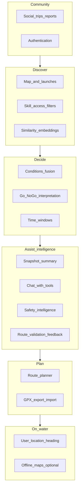

# EddyScout — product roadmap

High-level feature map for a PNW-focused kayak companion: **decision-first**, **local nuance**, **conditions fusion**, **honest safety framing**, and **Flutter + Mapbox** on the client. This document is a living plan; tick or adjust as you ship.

> **Platform:** target architecture is **complete** (waves 1–3 merged; see § Platform architecture). **Product work** is Phase C+ below. New UI belongs in `packages/features/*/presentation/`, not `apps/eddyscout/lib/screens/`.
>
> **Last updated:** 2026-06-14

## Vision

EddyScout helps paddlers **discover where to go**, **understand river and weather context in one place**, and **decide if today makes sense** for their skill level—starting in the Portland / greater PNW area. It is not a replacement for judgment, training, or on-scout assessment.

## Product pillars



| Pillar | Intent |
|--------|--------|
| **Discover** | Map, launches, filters (skill, access, hazards); optional **semantic “similar to”** via embeddings. |
| **Decide** | Fuse weather, wind, flow, tides where relevant; output Go / marginal / no-go + reasons. |
| **Assist (LLM)** | Summaries, Q&A, and coaching **grounded in fetched data + curated metadata**—not a replacement for judgment. |
| **Plan** | Routes, put-in / take-out, GPX. |
| **On-water** | Location, bearing, later drift-aware hints; optional offline. |
| **Community** | Trips, condition reports, finding paddlers—without unsafe defaults on live tracking. |

---

## Feature list (your themes + gaps)

| # | Feature | In-product meaning | Notes |
|---|---------|-------------------|--------|
| 1 | **Weather** | Temp, precip, clouds; NOAA or a focused weather API | Wind is a separate axis for paddlers; hyperlocal matters (Columbia, gorge). |
| 2 | **River conditions** | Wood, dam releases, “sketchy at this flow,” closures | Largely **not** in public APIs → crowdsourced + curated **local intelligence**. |
| 3 | **Wind** | Speed + **gusts**, direction; marine zones where relevant | Open water and fetch; tie to **segment exposure** over time. |
| 4 | **River flow / speed** | USGS cfs / gauge height; **gauge → launch or segment**, not one number per whole river | **Per-stretch** flow bands (min / optimal / max). |
| 5 | **Go / no-go** | Clear call + reasons + **marginal**; legal/UX **disclaimer** | Include cold water and skill; avoid false confidence. |
| 6 | **Route planner** | Put-in / take-out, snap or align to water; later drift vs wind | Needs **river geometry** or curated segments. |
| 7 | **Social** | Trip intent, post-trip reports (conditions, wildlife), find paddlers | Start with **planned trips + TTL**; moderation + privacy before heavy live location. |
| 8 | **Authentication** | Accounts, saved content, posts | Defer until social or saved routes need identity. |
| — | **Tides / currents** | Estuary, coastal, Sauvie-adjacent | NOAA tides/currents APIs. |
| — | **Cold water / safety UX** | Hypothermia / cold-shock awareness; education links | Persistent PNW-relevant messaging. |
| — | **User location + “which way”** | GPS, bearing to waypoint; later smarter drift hints | Core **on-water** value from early product discussions. |
| — | **Offline** | Cached tiles; optional last-known conditions | Mapbox offline + scoped geography. |
| — | **Alerts** | Flow or wind thresholds | Often pairs with subscriptions later. |
| — | **Trip log / GPX** | History, export, share | Complements routes and social. |
| — | **Access / permits / tribal** | Legality, seasonality, respect for restrictions | Static metadata + clear UI tags. |
| — | **Legal / attribution** | Mapbox, USGS, NOAA; liability copy | Ship early. |
| — | **Condition snapshot summary (LLM)** | Short narrative digest of the current **ConditionsSnapshot** + launch tags (exposure, tide relevance, river system) | **Grounded:** model input is structured JSON + timestamps; output is “planning copy,” not a safety guarantee. |
| — | **Conditions chat (LLM + tools)** | User asks questions; model calls **tools** to refresh or re-fetch NWS / USGS / tides / marine as needed | Tools = same provider layer as today (`ConditionsService` or successors); no browsing arbitrary web unless explicitly added later. |
| — | **Route validation / feedback (LLM)** | User describes or selects put-in / take-out (or future drawn route); model **comments on plausibility** vs curated segments, distance class, exposure—**not** turn-by-turn navigation | Start as “validation / sanity check” before full geometry-backed planner. |
| — | **Safety intelligence layer (LLM + rules)** | Cold water, skill fit, PFD/whistle/permits, when to bail—**templated canonical facts** + optional LLM phrasing; reinforce disclaimers | Must not contradict static safety copy; optional RAG over **your** editorial docs later—not open-ended medical advice. |
| — | **Embeddings & similarity search** | **“Similar launches”** / **similar routes** / similar trip reports by embedding a short **canonical text profile** per entity (name, river, exposure, notes, skill tags, distance class) | Feasible and common pattern: **vector DB** (e.g. pgvector, hosted vector index) or on-device for small corpora; combine with **filters** (distance, river system, skill) so results stay sensible. Rebuild or upsert vectors when curated data changes. |

**Hidden but critical:** **gauge–segment–launch data model** (which USGS site applies to which stretch)—this is foundational for items 4 and 5. **Embedding corpus** (what text you embed + version) is similarly foundational for trustworthy similarity.

---

## Execution order

| Step | Work | Status |
|------|------|--------|
| 1 | **Platform waves 1–3** — monorepo, `@riverpod`, Result boundaries, router package, feature `presentation/` layering, app-shell closeout | **Done** (#19–#36, closeout) |
| 2 | **Phase C+** — product slices in this file (GPX, saved routes, moderation, auth, …) | **Now** |

---

## Platform architecture (complete)

Target repo/platform architecture is **done** for the current design. Shipped highlights (do not re-open as platform waves):

| Area | Notes |
|------|-------|
| Monorepo / melos / preflight / husky | Fast pre-commit; full gate on pre-push + CI (#24) |
| Coverage gates | 85% thresholds in `tooling/coverage.yaml`; CI enforces |
| Design system goldens + CI | Goldens on `macos-latest`; Ubuntu excludes `golden` tag |
| `@riverpod` codegen | Conditions, map, hydro, app shell, `packages/routing/` (#20–#23, #30) |
| Router package | `goRouterProvider`, redirects, gate screens in `packages/routing/` (#26, closeout) |
| `Result<T, AppFailure>` | Conditions, hydro, map boundaries (#28, #32, #33) |
| Feature layering | Conditions + map `presentation/`; token/web gates in routing (#35, #36, closeout) |
| Client telemetry v1 | Router screen tracking via `AnalyticsNavigatorObserver`; debug/no-op client; `report_submit_success` event |
| Integration tests (E2E) | Token gate + map → launch detail; CI Linux deps (#22, #25, #27) |

**Canonical design reference:** `docs/ARCHITECTURE.md` (package graph, layering, current implementation status).

### Platform follow-ups (deferred / partial)

Revisit when a product slice needs them — not blocking Phase C:

| Item | Status | Notes |
|------|--------|-------|
| **Mapbox mixin device coverage** | Partial | `lib/src/presentation/mapbox/` excluded from unit-coverage gate; add integration/device tests for camera, markers, style, route mixins |
| **`custom_lint` wiring** | Deferred | Analyzer version conflict with `riverpod_generator`; using `riverpod_lint` via `analysis_server_plugin` until deps align |
| **Riverpod-in-domain migration** | Partial | Repository DI tokens in domain; presentation providers still in feature packages |
| **`CancelToken` in domain HTTP contract** | Partial | Done in conditions; extend when adding HTTP in other features |
| **`INTEGRATION_MAP_STUB` branch** | Partial | Compile-time flag on `MapRoute`; covered by integration tests, not default unit tests |
| **Firebase bootstrap failure path** | Partial | `app_bootstrap.dart` Firebase init only exercised when `USE_FIREBASE=true` on device |
| **`eddyscout_map` core type re-exports** | Deferred | Barrel still re-exports `LaunchPoint` from core for ergonomics |
| **Hydro geodesy export coupling** | Deferred | `hydro_routing` data layer used directly by map presentation |

---

## Engineering standards (when building)

Apply these **with** the product slice that needs them — not as standalone platform waves:

| When you add… | Also do… |
|---------------|----------|
| **New Riverpod provider** | Use `@riverpod` codegen (`docs/CODEGEN.md`, `docs/STATE_MANAGEMENT.md`) |
| **New package I/O** (HTTP, callables, file load) | Return `Result<T, AppFailure>` or surface typed `AppFailure` via `AsyncError`; wire `CancelToken` per `docs/NETWORKING.md` (conditions is the reference) |
| **New user-facing screen** | Build in `packages/features/<name>/presentation/`; bind routes from `apps/eddyscout/lib/routing/app_routes.dart`; add path to `AnalyticsScreenNames` (screen views are automatic via router observer) |
| **New design-system widget** | Add golden test (`docs/TESTING.md`; `packages/design_system/test/goldens/`) |
| **New critical user journey** | Add or extend `apps/eddyscout/integration_test/` per `docs/TESTING.md` integration criteria |
| **New conversion / goal flow** | Add `AnalyticsEvent` per `docs/ANALYTICS.md` taxonomy (no PII in parameters) |
| **Edit launch detail UI** | Extract new sections into separate part files/widgets; avoid growing `widgets_conditions.dart` / `widgets_reports.dart` in place |
| **Authentication / saved identity** | Add `flutter_secure_storage` for tokens/credentials; add session auth router guards beyond Mapbox token/web redirects (`docs/NAVIGATION.md`, `docs/SECURITY.md`) — see **(Phase C) Auth** below |
| **Multi-tab navigation** | Use `StatefulShellRoute` (`docs/NAVIGATION.md`) |
| **Remote image UI** | Use `CachedNetworkImage` sized to display dimensions (`docs/PERFORMANCE.md`) |

### Infra bundled with product features

| Product trigger | Engineering work |
|-----------------|------------------|
| **(Phase C) Auth** / saved routes needing identity | `flutter_secure_storage`, session router guards, auth feature package |
| **Tab shell** (e.g. map + trips + profile) | `StatefulShellRoute`, shell routes in `packages/routing/` |
| **(Phase D) Media** / trip cards with photos | `CachedNetworkImage`, image sizing, optional upload pipeline |
| **New HTTP-heavy feature** | Extend `CancelToken` + `Result` pattern from conditions to that feature's repos |

### Integration test backlog

Add E2E coverage when the corresponding product slice ships (not before):

- **Report submit journey** — when moderation or report UX changes materially
- **Degraded / offline conditions** — when offline or cached conditions ship
- **Auth session flow** — with **(Phase C) Auth**

Budget: at most **one new** `integration_test/` file per product epic unless justified in the PR.

---

## Phasing

### Recommended next implementation

**Now (product — Phase C):** Prioritize **waterway geometry expansion** (import all Portland-area river systems), **A\* upgrade**, and **launch reachability / suggested trips**. GPX export/import and saved routes v1 are already built. **Moderation** for condition reports is an alternative early Phase C slice if community trust is the bottleneck.

**Done (platform):** Waves 1–3 — monorepo, `@riverpod`, Result boundaries, router package, feature presentation layering, app-shell closeout (#19–#36).

**Already shipped (context):** Route preview (v1) — planning mode on the map, put-in / take-out from launches, polyline along bundled hydro GeoJSON (`assets/hydro/`; Willamette Portland reach first). Multi-stop routing, GPX export/import, saved routes with local persistence, map-first UX with bottom sheets and 4-tab shell.

---

## Master implementation checklist (living)

Single list of **everything** tracked for build progress. Tags show the original phase/pillar. Update `- [ ]` → `- [x]` here only (no duplicate subsection checklists).

### Shipped

- [x] **(Phase A)** Map + Mapbox + expanded regional launch pins
- [x] **(Phase A)** Tap launch → detail with **NWS** weather (Open-Meteo fallback), **USGS** flow where linked, **NOAA** tides, exposure/tide tags
- [x] **(Phase A)** **NWS marine** on launch detail (Coastal Waters Forecast / zone extract; not `/zones/marine/{id}/forecast`)
- [x] **(Phase A)** Local Mapbox token via `.local.env` + script
- [x] **(Phase A)** In-app **safety / disclaimer** on launch detail (extend globally as needed)
- [x] **(Phase A)** **Stub Go/No-Go** rules engine (wind, marine keywords, coarse cfs by river class; marginal / no-go / insufficient data)
- [x] **(Phase B)** Per-launch **cfs bands** (`LaunchFlowBands`; evaluator prefers bands, else river-class fallback)
- [x] **(Phase B)** **Skill profile** (beginner / intermediate / advanced) → wind thresholds + `SharedPreferences` + UI on launch detail
- [x] **(Phase B)** **Forecast time hint** (`periodStart` low-light hours → info only)
- [x] **(Phase B)** Gust-aware wind + marine text + flow rules in evaluator
- [x] **(Firebase)** Repo `firebase/` Functions (`us-west2`): `submitConditionReport`, `listConditionReports`, `summarizeLaunchReports`, `summarizeConditions` (Anthropic; deploy + secrets)
- [x] **(Firebase)** Firestore `conditionReports` writes **only** from Admin SDK; Callables from client; rules deny broad client access
- [x] **(Firebase)** Flutter: `firebase_core`, `cloud_functions`, `firebase_auth` (anonymous), `USE_FIREBASE`, JSON payload for summaries
- [x] **(Firebase)** **Report conditions** sheet + **AI summary** card when Firebase init succeeds
- [x] **(Firebase)** Cloud Run **invoker** + Android callable auth path (see `firebase/DEPLOY.md`)
- [x] **(Reports)** List recent reports per launch — `listConditionReports`; time-ordered list; light attribution
- [x] **(Reports)** AI digest of recent reports — `summarizeLaunchReports`; cache (`launchReportDigests`) + rate limits (`reportDigestRate`)
- [x] **(Reports)** Trust copy on digest; raw report list below digest on launch detail
- [x] **(Phase D)** In-app condition reports **reader + digest** (same as **Reports** rows above)
- [x] **(Phase E)** **Default model** path — Haiku via Cloud Function for summaries
- [x] **(Phase E)** **Snapshot summary (v1)** — `summarizeConditions` + “Summarize with AI” on launch detail
- [x] **(Phase E)** **Reports digest** (community notes paraphrase; see **Reports** rows above)
- [x] **(Infra)** Result-based providers + cancellation (CancelToken / callable cancel guards) for conditions, reports, and AI summary
- [x] **(Infra)** Client telemetry v1 — router screen tracking, debug/no-op `AnalyticsClient`, `report_submit_success` event

### Not yet

> **Gate:** Phase C items below are ready to implement — platform architecture is complete (§ Platform architecture).

- [ ] **(Reports / mod)** Moderation — admin queue, TTL, keyword hold (optional report-abuse UX)
- [x] **(Phase C)** Route preview on map — planning mode, put-in / take-out from existing launches, path along bundled open hydro LineStrings (`assets/hydro/`; Willamette Portland reach first); not navigation-grade
- [x] **(Phase C)** Route planner follow-ups — more rivers / segment snap (`feat/route-planner-hydro-expansion`; Willamette + Columbia gorge hydro, edge snap, `PlannedRoute` domain model)
- [ ] **(Phase C / R1a)** Route planner: Columbia OSM import — repeatable Overpass merge, Willamette mouth tied to real OSM vertices, geometry gate in CI (scoped PR before full R1)
- [ ] **(Phase C / R1)** Route planner: import Columbia, Clackamas, slough, Tualatin, Sandy waterway geometry from OSM Overpass; validate connectivity; bundle as `assets/hydro/`
- [ ] **(Phase C / R1)** Route planner: add NHD download + conversion script for higher-quality river centerlines
- [ ] **(Phase C / R2)** Route planner: upgrade Dijkstra to A* with priority queue and haversine heuristic
- [x] **(Phase C / R2)** Route planner: unified multi-system graph with cross-system routing (Willamette → Columbia confluence)
- [ ] **(Phase C / R2)** Route planner: pre-computed binary graph serialization for faster cold start
- [ ] **(Phase C / R3)** Route planner: pre-snap launches to graph vertices at build time; snap quality validation
- [ ] **(Phase C / R3)** Route planner: reachability index per launch (nearby launches within 5/10/20 mi graph distance)
- [ ] **(Phase C / R3)** Route planner: suggested trips from each launch (distance, time, waypoints)
- [ ] **(Phase C / R3)** Route planner: "Trips from here" UI on place peek and launch detail
- [x] **(Phase C)** Route planner: **personalized paddling speed** at sign-up / profile for trip-time estimates (default 4 km/h until set; optional learning from trip log)
- [ ] **(Phase C)** **Metric / imperial units** — user preference for distance (km/mi) and speed (km/h/mph) across settings, route planner, and saved routes
- [ ] **(Phase C / R4)** Route editing: arbitrary waypoints (drop pin on waterway, snap to graph)
- [ ] **(Phase C / R4)** Route editing: drag-to-edit polyline mid-points to reroute through alternate channels
- [ ] **(Phase C / R4)** Route editing: loop routes, island hopping, multi-day expedition waypoints
- [ ] **(Phase C / R4)** Route editing: route alternatives (shortest, most sheltered, scenic)
- [ ] **(Phase C)** GPX export / import
- [ ] **(Phase C)** Trip log
- [ ] **(Phase C)** Saved routes (v1) — name/description, categories, favorites, notes, private by default
- [ ] **(Phase C)** Saved routes metadata (v1) — difficulty, distance, time estimate, exposure, tide dependency, skill level
- [ ] **(Phase C)** **Auth** when identity is required for saves — accounts, `flutter_secure_storage` for credentials, session router guards (see § Engineering standards)
- [ ] **(Phase D)** Planned trips / trip intent
- [ ] **(Phase D)** Moderation posture (policy + product, beyond technical queue above)
- [ ] **(Phase D)** **Live pins** only with explicit privacy/product decision
- [ ] **(Phase D)** User profile (v1) — basic stats, achievements placeholder, activity history
- [ ] **(Phase D)** Social feed (v1) — follow, likes/comments, basic posting
- [ ] **(Phase D)** Trip sharing (v1) — share cards + route screenshots + privacy controls
- [ ] **(Phase D)** Privacy controls (v1) — public/private trips, blur start/end, hide home launch
- [ ] **(Phase D)** Community reports expansion — hazards, debris, closures, boat traffic, algae blooms, wildlife
- [ ] **(Phase D)** Launch contributions (v1) — add/edit launches, photos, description edits, report inaccuracies
- [ ] **(Phase D)** Reputation / trust (v1) — badges, verified reports, moderation hooks
- [ ] **(Phase E)** **Model-agnostic client** (`LlmClient`-style abstraction)
- [ ] **(Phase E)** **Chat + tools** (refresh conditions, list launches, etc.)
- [ ] **(Phase E)** **Route validation** (LLM + structured gaps, no invented hazards)
- [ ] **(Phase E)** **Safety intelligence** (canonical facts + optional LLM phrasing)
- [ ] **(Phase E)** **Ops** — quotas, logging, cost dashboards
- [ ] **(Phase E)** Go / No-go typed reasons → localized labels (enum/codes + ARB; no raw reason strings in UI)
- [ ] **(Phase E)** Conditions intelligence (v2) — user thresholds (wind/current/temp), alerts, time windows
- [ ] **(Phase E)** Dynamic risk scoring (v1) — beginner safe / caution / expert only (wind/gust/current/tide/darkness/temp/exposure)
- [ ] **(Phase E)** Float plans (v1) — route + emergency contacts + return time + overdue reminder flow
- [ ] **(Phase E)** Safety alerts (v1) — “storm approaching”, “exceeds your threshold”, “current increasing”
- [ ] **(Phase F)** **Embedding model** (pluggable API / local)
- [ ] **(Phase F)** **Launch similarity (v1)** — profiles + nearest neighbors (“Similar ramps”)
- [ ] **(Phase F)** **Query paths** — from launch + optional NL
- [ ] **(Phase F)** **Route similarity** (after routes exist)
- [ ] **(Phase F)** **Hybrid search** (geo / river / skill filters)
- [ ] **(Phase F)** **Ops** — index versioning, backfill, no live cfs in embeddings
- [ ] **(Phase F)** AI route recommendations (v1) — “protected for wind”, “good on outgoing tide”, “beginner-friendly nearby”
- [ ] **(Phase F)** Route discovery surfaces (v1) — nearby, trending, beginner, scenic, weather-appropriate
- [ ] **(Phase R5)** Server-side routing: PostGIS + pgRouting for dynamic-weight routes and graph > 100k nodes
- [ ] **(Phase R5)** Route API: serverless endpoint; request waypoints + options → GeoJSON polyline response
- [ ] **(Phase R5)** Hybrid model: client-side for cached local; server for cross-region or closure-aware routing
- [ ] **(Phase R6)** Continental routing: regional geometry tiles + graph stitching + hierarchical routing
- [ ] **(Phase R6)** Incremental NHD import: HUC-region shapefiles → PostGIS → pgRouting network

### Remaining major features (from the feature table, not all on the build checklist)

These themes in **Feature list (your themes + gaps)** are still largely **future** relative to what the checklist tracks explicitly:

- **Map / discover:** skill & access **filters** on the map; **alerts** (flow/wind thresholds); **tab shell** (`StatefulShellRoute`) when adding secondary top-level destinations
- **Decide:** richer **time windows**; **cold water / safety UX** beyond the launch disclaimer
- **On-water:** **User location + bearing** to waypoint; **offline** maps / cached conditions
- **Data / trust:** **Access / permits / tribal** metadata + UI tags
- **Social (beyond reports):** **Trip log** as history; fuller **social** (find paddlers, etc.) with the MVP non-goals still in mind

Additional feature themes explicitly on the product roadmap but not fully itemized above yet:

- **Trip recording (GPS)** — record/pause/resume/background + distance/duration/speed; later wind/current/tide-adjusted metrics
- **Live navigation** — on-route guidance, off-route detection, audible/vibration alerts, offline nav
- **Offline support** — offline maps, offline routes, offline navigation, offline recording, background sync on reconnect
- **Media** — photos/videos, trip cards, auto-generated summaries (`CachedNetworkImage` when showing remote images; see § Engineering standards)
- **Search & filtering** — route + launch search with facets (distance/difficulty/water type/wind protection/tide suitability/scenic)
- **Gamification** — achievements, challenges, streaks

---

## LLM / API strategy

- **Provider-agnostic:** One interface (e.g. `LlmClient`) with per-provider adapters (Anthropic, OpenAI, others). Model id + max tokens + tool schema passed per call.
- **Cost:** Prefer **Haiku-class** models for v1 chat and summaries; reserve larger models for optional “deep dive” if product demands it.
- **Grounding:** System prompts require the model to **only** cite numbers that appear in tool results or provided JSON; if unknown, say so.
- **Non-goal:** The LLM is not the legal “decision”—copy stays informational; Go/No-Go remains rules + human judgment.

---

## Embeddings / vector search (summary)

- **Possible:** Yes. Similarity search is **standard**: embed fixed text profiles for launches (and later routes), store vectors, retrieve **k nearest neighbors**; optionally merge scores with metadata filters.
- **Not magic:** Quality depends on **what you embed** (rich, consistent descriptions + tags) and **hybrid filters** (region, river, skill). Otherwise “similar” can mean linguistically close but geographically silly.
- **Conditions:** Do **not** rely on embeddings for “similar **current** weather”—that’s real-time data. Use embeddings for **place and route character**; keep conditions as separate queries.

---

## Data sources (target)

| Source | Use |
|--------|-----|
| **Mapbox** | Basemap, style, later offline |
| **OpenStreetMap / Overpass** | Waterway geometry (`waterway=river`, `waterway=canal`, `natural=water`, `water=lake`); basis for routable graph |
| **US NHD (National Hydrography Dataset)** | Higher-quality centerlines for US rivers/streams; alternative or supplement to OSM for accuracy |
| **USGS** | River discharge / gauge height |
| **NOAA** | Weather, marine text; tides/currents where applicable |
| **Crowd / editorial** | Hazards, wood, subjective stretch quality |
| **LLM provider (optional)** | e.g. Anthropic / OpenAI for summaries & chat—**keys** via env / backend; not required for core map + conditions |
| **Embedding provider (optional)** | API or local model for **launch/route vectors**; often separate from chat LLM; **model-agnostic** storage (dimension + provider id per index) |

Attribute and comply with each provider’s terms in the app.

---

## Waterway routing strategy

The routing engine is the foundation for trip planning, discovery, and on-water features. The strategy below describes how the system should evolve from the current single-river bundled GeoJSON to a scalable graph-routed architecture.

### Core principle

**Do not connect launches directly.** Route along actual waterway geometry. Direct launch-to-launch edges lose:

- Actual river/channel shape (bends, islands, channels)
- Accurate distance
- Alternate routes (side channels, portage options)
- Scalability (adding a launch means re-wiring all connections)

Instead: **waterway geometry → graph → snap launches → route through graph**.

### Architecture layers

```
Waterway GeoJSON (OSM / NHD / curated)
  → Graph builder (nodes + undirected weighted edges)
    → Launch snapper (nearest graph vertex per launch)
      → Pathfinder (A* / Dijkstra)
        → GeoJSON polyline
          → Mapbox LineLayer display
```

### Phase R1: Full waterway geometry (current gap)

**Goal:** Import all routable waterways for Portland metro and greater PNW.

**Data sources (priority order):**

1. **OpenStreetMap via Overpass API** — query `waterway=river`, `waterway=stream`, `waterway=canal`, `natural=water`, `water=lake`, and `natural=coastline` for the target bounding box.
2. **US NHD (National Hydrography Dataset)** — higher resolution centerlines; supplement OSM where it lacks detail (smaller tributaries, accurate river mile alignment).
3. **OpenMapTiles** — pre-processed vector tiles if batch geometry extraction is easier than raw Overpass.

**Target river systems (Portland area):**

| System | Status |
|--------|--------|
| Willamette (main stem Portland reach) | Done (bundled GeoJSON) |
| Columbia (Portland–Sauvie–St. Helens) | **R1a in progress** — OSM Overpass import (`scripts/overpass/fetch_columbia_waterway.py`); mouth shares Willamette vertex; geometry gate in preflight |
| Clackamas | Not started |
| Multnomah Channel / slough | Not started |
| Tualatin | Not started |
| Sandy | Not started |

**Output:** One GeoJSON `FeatureCollection` per river system with `river_system` property; each feature is a `LineString` of centerline coordinates.

**Tasks:**

- [x] Write Overpass import script for Columbia lower + gorge (`scripts/overpass/fetch_columbia_waterway.py`)
- [x] Connect Willamette mouth via shared OSM vertices (no hand-drawn mouth connector)
- [x] Add bundled geometry gate — fail CI when any edge > 2000 m or confluence gaps > 12 m (`scripts/check_hydro_geometry.sh`)
- [ ] Write Overpass query scripts for remaining target systems (`scripts/overpass/`)
- [ ] Validate geometry connectivity (no gaps between line segments)
- [ ] Merge disconnected segments within snap threshold
- [ ] Bundle as `assets/hydro/<system>_waterway.geojson`
- [ ] Add NHD download + conversion script for higher-quality alternatives
- [x] Document geometry provenance per file in `scripts/README-hydro.md`

### Phase R1a: Columbia OSM import (scoped — ship before full R1)

**Goal:** Replace hand-curated Columbia mouth connector and land chords with repeatable OSM import; gate bundled geometry in CI.

**Scope (one PR, not all of R1):**

- [x] Import + merge real Columbia centerlines — Overpass merge of connected `waterway=river|canal|fairway` ways (`scripts/overpass/fetch_columbia_waterway.py`)
- [x] Connect at Willamette mouth using shared OSM vertices — read mouth from `willamette_waterway.geojson`; no hand-drawn mouth connector
- [x] Geometry gate — `scripts/check_hydro_geometry.sh` fails preflight when any edge > 2000 m or confluence gaps > 12 m
- [ ] Commit bundled assets after manual route check (Cathedral Park → Glenn Otto follows channel, not Vancouver land)

**Out of scope for R1a (defer to full R1):** Clackamas, slough, Tualatin, Sandy main-stem bundles; NHD pipeline as primary source; Overpass scripts per remaining system.


### Phase R2: Graph construction improvements

**Current state:** `RiverLineGraph` builds undirected edges with haversine weights, 12 m vertex merge threshold.

**Improvements:**

- [ ] **Priority queue Dijkstra or A\*** — replace O(n²) linear scan; required before graph exceeds ~5k nodes
- [ ] **A\* heuristic** — haversine straight-line distance to destination; admissible for undirected waterway graphs
- [ ] **Vertex merge spatial index** — replace O(n²) `findOrAdd` linear scan at graph build; required before R1 geometry exceeds ~5k nodes
- [ ] **Configurable vertex merge threshold** — 12 m is tight for NHD; test 20–30 m for denser datasets
- [ ] **Edge metadata** — store `river_system`, optional `one_way` flag (for future flow direction), optional hazard/closure flag
- [ ] **Multi-system graph** — single unified graph with labeled edges; cross-system routing where waterways physically connect (e.g. Willamette → Columbia confluence)
- [ ] **Bidirectional edges with direction cost** — downstream cheaper than upstream (integrate average current speed when available)
- [ ] **Graph serialization** — pre-compute graph offline; ship as binary adjacency list (faster cold-start than parsing GeoJSON each launch)

**Performance targets:**

| Metric | Target |
|--------|--------|
| Portland metro graph size | 20k–50k nodes |
| Route computation (client-side) | < 200 ms for 50k nodes with A* |
| Cold start (graph load + parse) | < 500 ms from serialized binary |

### Phase R3: Launch snap and discovery

**Current state:** Dynamic snap at route time via `_nearestSnap`, which linearly scans all vertices and edges O(V+E) per endpoint (twice per route). Acceptable at ~100 nodes today; becomes costly at R1 metro scale (20k–50k nodes). No pre-computed reachability.

**Improvements:**

- [ ] **Pre-snap at build time** — store `launch.graphNodeId` in catalog; validate during codegen / asset pipeline (catalog launches skip route-time graph scan)
- [ ] **Spatial index for route-time snap** — replace O(V+E) `_nearestSnap` with grid or R-tree lookup within `maxSnapMeters`; required before 20k+ node graphs and for R4 arbitrary waypoints / drop-pin routing
- [ ] **Snap quality gate** — warn if snap distance > 200 m (indicates geometry gap near a launch)
- [ ] **Reachability index** — BFS from each launch up to distance thresholds; store per launch:

```json
{
  "launchId": "stjohns",
  "nearbyLaunches": {
    "5mi": ["cathedralPark", "universityOfPortland"],
    "10mi": ["sellwoodRiverfront", "willamettePark"],
    "20mi": ["sauvieIsland", "milwaukieBay"]
  }
}
```

- [ ] **Suggested trips** — pre-compute one-way and round-trip suggestions per launch using graph distance + common waypoints:

```json
{
  "launchId": "cathedralPark",
  "suggestedTrips": [
    {
      "destination": "sellwoodRiverfront",
      "distanceKm": 8.2,
      "estimatedMinutes": 123,
      "waypoints": ["cathedralPark", "sellwoodRiverfront"]
    },
    {
      "destination": "sauvieIsland",
      "distanceKm": 14.5,
      "estimatedMinutes": 218,
      "waypoints": ["cathedralPark", "stjohns", "sauvieIsland"]
    }
  ]
}
```

- [ ] **UI: "Trips from here"** — surface nearby launches and suggested trips on the place peek sheet and launch detail screen
- [ ] **UI: Trip length filters** — short (< 5 mi), medium (5–10 mi), long (> 10 mi) on suggested trips

### Phase R4: Multi-stop and advanced routing

**Current state:** Multi-stop works via chained segments on same river system.

**Improvements:**

- [ ] **Cross-system routing** — route across Willamette → Columbia confluence; requires unified multi-system graph
- [ ] **Arbitrary waypoints** — allow user to drop a pin on any waterway (snap to nearest graph vertex); not just catalog launches
- [ ] **Loop routes** — detect same start/end; offer "out-and-back" or "loop via alternate channel"
- [ ] **Island hopping / archipelago routes** — multiple segments with portage indicators between disconnected water bodies
- [ ] **Multi-day expedition support** — save waypoints as overnight stops; segment time estimates per day
- [ ] **Drag-to-edit route** — user drags mid-point of polyline to reroute through a different channel; re-snap to graph and re-route affected segments
- [ ] **Route alternatives** — compute 2–3 route options (shortest, most sheltered, scenic) using edge attributes

### Phase R5: Server-side routing (scale)

**Current state:** 100% client-side. Acceptable for Portland (~20k–50k nodes).

**When to move server-side:**

- Graph exceeds ~100k nodes (multiple metro areas or regional coverage)
- Real-time hazard/closure data needs to modify graph weights dynamically
- Route sharing requires server-computed canonical polylines

**Architecture (when needed):**

```
Client → Route API (POST /routes/plan)
  → PostGIS graph stored in DB
  → pgRouting or custom A* on server
  → GeoJSON response
  → Mapbox display
```

- [ ] **PostGIS + pgRouting** — import graph edges as a routable network; use `pgr_astar` or `pgr_dijkstra`
- [ ] **Route API** — serverless function or lightweight service; request: `{waypoints: [{lat, lon}...], options: {avoidUpstream, preferSheltered}}`; response: GeoJSON polyline + metadata
- [ ] **Hybrid model** — client-side for cached local area; server for cross-region or dynamic-weight routes
- [ ] **Response time target** — < 500 ms for regional routes (Portland → Seattle waterway corridor)

### Phase R6: Continental routing

**Goal:** Portland → Seattle (or any coast-to-coast waterway route) is the same operation as Sellwood → St. Johns — the routing engine doesn't know or care about distance; it's just traversing a waterway graph.

**Requirements:**

- [ ] **Regional geometry tiles** — download/cache geometry per bounding box; don't ship entire US as bundled asset
- [ ] **Graph stitching** — merge regional graphs at boundary edges (river crosses tile boundary → shared vertices)
- [ ] **Hierarchical routing** — coarse graph (major rivers only) for long routes; fine graph for local segments; cascade for speed
- [ ] **Server-mandatory** — client can't hold 1M+ nodes in memory; all continental routes go through Route API
- [ ] **Incremental NHD import** — script to import NHD HUC-region shapefiles → PostGIS → pgRouting network

### Routing decision tree (implementation order)

```
1. Columbia OSM import + geometry gate (R1a)           ← IN PROGRESS
2. Import remaining Portland-area waterway geometry (R1)
3. Upgrade pathfinder to A* with priority queue
4. Pre-snap launches; build reachability index
5. Surface "trips from here" in UI
6. Cross-system routing (unified graph)              ← DONE (R2)
7. Arbitrary waypoints + drag-to-edit
8. Server-side routing when graph > 100k nodes
9. Continental expansion
```

---

## MVP non-goals (until explicitly pulled in)

- Full social graph, DMs, or always-on live location
- National coverage before PNW is strong
- Scuba / dive-specific flows (unless scope is intentionally split)
- Guaranteed “safe” verdicts (copy must stay informational)
- LLM **inventing** hazards, closures, or flows not present in tool/API output
- LLM-only **Go/No-Go** without explicit rules + disclaimers

---

## Risks

| Risk | Mitigation |
|------|------------|
| **Liability** from automated Go/No-Go | Disclaimers; prefer “marginal”; no medical or rescue guarantees |
| **Wrong gauge for stretch** | Model gauge–segment links; show data source + timestamp |
| **Social abuse / harassment** | Reports, blocks, minimal PII; TTL on location-ish posts |
| **Token / API costs** | Cache conditions; rate-limit; restrict geography early |
| **LLM hallucination next to safety** | Tool-grounding, strict system prompts, show sources; safety facts from canonical copy |
| **LLM spend / abuse** | Per-user or per-device quotas; Haiku by default; short context windows |
| **Bad similarity results** | Hybrid geo/skill filters; human-readable “why similar”; refresh embeddings when copy changes |

---

## How to use this file

- **Platform vs product:** shipped platform architecture is summarized in § Platform architecture; ongoing engineering rules in § Engineering standards; product phases and checklist live in the sections below.
- Update the **Master implementation checklist** (`- [ ]` → `- [x]`) when you ship; keep **Recommended next implementation** and **Execution order** in sync when priorities change.
- Add **dates** or **PR links** inline next to items when helpful.
- Trim the feature table above if you descope; keep **pillars** stable for narrative.
